# Boosting Algos – Loan Approval Explainer

A Next.js (App Router) application that explains and visualizes loan approval decisions using modern React, Tailwind CSS, and a rich UI component set.

## Features

- **Next.js 15** with **React 19** (App Router)
- **TypeScript** for type-safe development
- **Tailwind CSS** with shadcn/ui style primitives and Radix UI
- Interactive charts via **Recharts**
- Theming support with **next-themes**

## Tech Stack

- Next.js, React, TypeScript
- Tailwind CSS, PostCSS, Autoprefixer
- Radix UI, shadcn/ui-like components (`components/`), lucide-react icons
- Recharts, embla-carousel

## Getting Started

Prerequisites:
- Node.js >= 18.18 (Next.js 15 requirement)
- A package manager: npm, pnpm, or yarn (pick one and stick to it)

Install dependencies:
- npm:
  ```bash
  npm install
  ```
- pnpm:
  ```bash
  pnpm install
  ```
- yarn:
  ```bash
  yarn install
  ```

Run the development server:
```bash
# npm
npm run dev
# pnpm
pnpm dev
# yarn
yarn dev
```
Then open http://localhost:3000 in your browser.

Build for production:
```bash
# npm
npm run build
# pnpm
pnpm build
# yarn
yarn build
```

Start the production server (after building):
```bash
# npm
npm start
# pnpm
pnpm start
# yarn
yarn start
```

Lint:
```bash
# npm
npm run lint
# pnpm
pnpm lint
# yarn
yarn lint
```

## Project Structure

```
ML-Era_DHV-Project-main/
├─ app/                    # App Router pages/layouts
├─ components/             # Reusable UI components
├─ hooks/                  # Reusable React hooks
├─ lib/                    # Utilities and helpers
├─ public/                 # Static assets
├─ styles (via Tailwind)   # Tailwind config-driven styling
├─ App.tsx                 # App-level component usage
├─ tailwind.config.ts      # Tailwind configuration
├─ postcss.config.mjs      # PostCSS configuration
├─ next.config.mjs         # Next.js configuration
├─ tsconfig.json           # TypeScript configuration
├─ package.json            # Scripts and dependencies
├─ LICENSE                 # Project license
└─ README.md               # This file
```

## Environment Variables

This project currently does not require environment variables by default. If you add any (e.g., analytics, APIs), create a `.env.local` file at the project root and reference them with `process.env.YOUR_VAR`.

## Styling

- Tailwind CSS utilities and design tokens are configured via `tailwind.config.ts`.
- Component primitives are built on Radix UI and utilities like `class-variance-authority`, `clsx`, and `tailwind-merge`.

## Deployment

- Recommended: **Vercel** for zero-config Next.js deployments.
- Steps (Vercel):
  - Push your repository to GitHub/GitLab/Bitbucket.
  - Import to Vercel and select the project.
  - Framework preset: Next.js. Build command: `next build`. Output: `.next` (default).
  - Set any required environment variables in Vercel if added.

## Troubleshooting

- Ensure Node >= 18.18.
- Delete lockfiles except the one for your chosen package manager to avoid conflicts (e.g., keep only `package-lock.json` if using npm).
- If styles don’t load, confirm Tailwind is set up and `globals.css` or relevant imports are present in your root layout.

## Screenshots


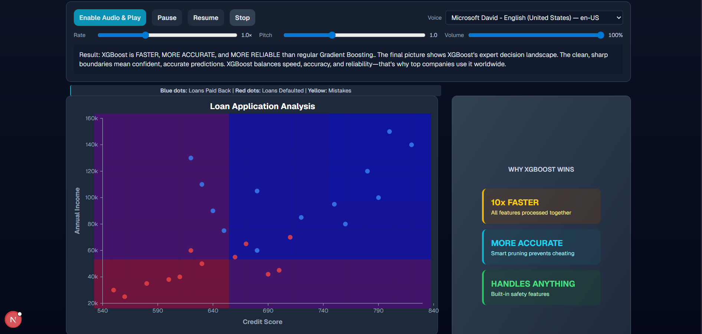
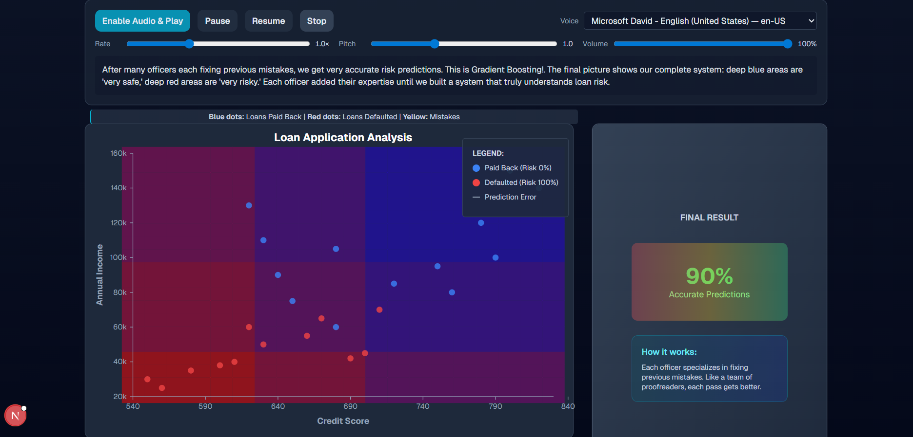
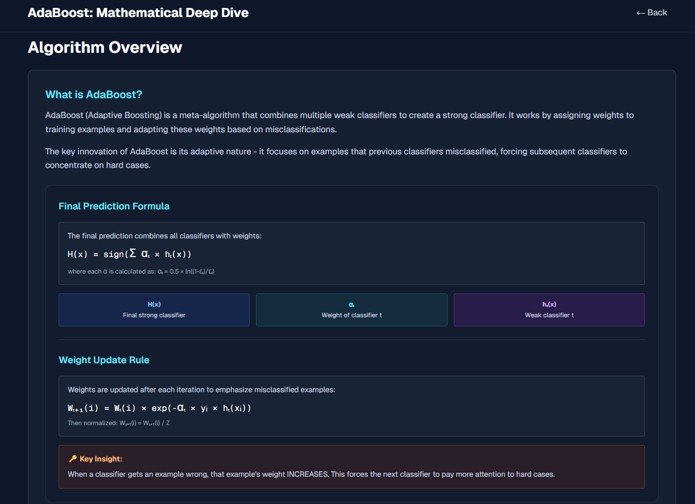
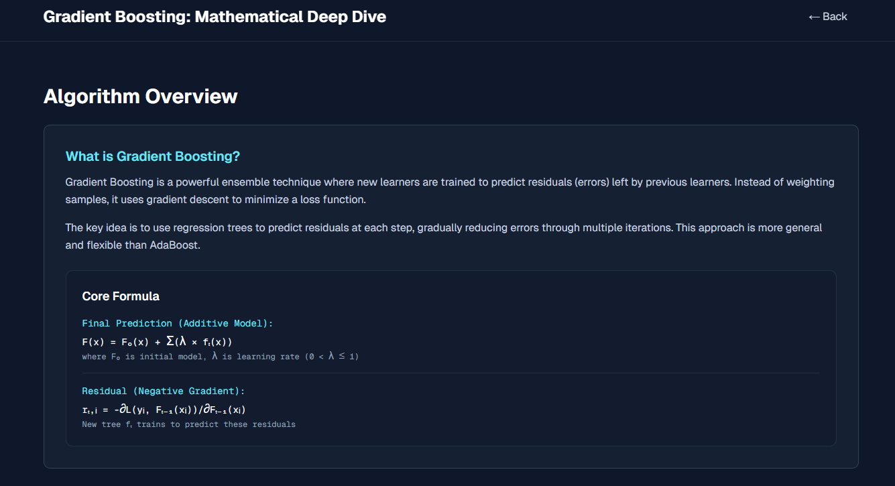
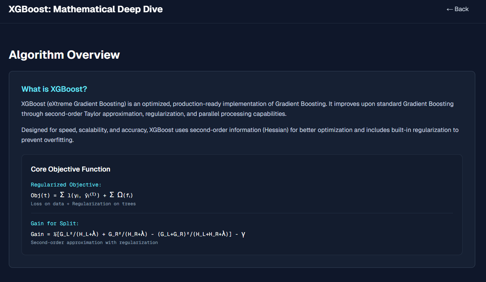
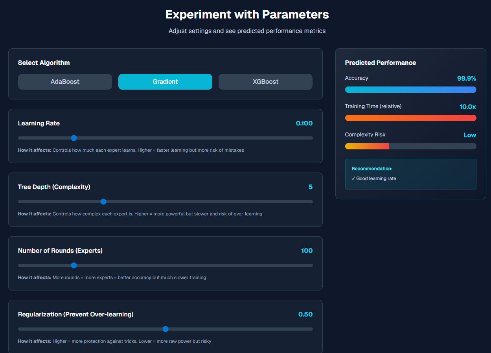
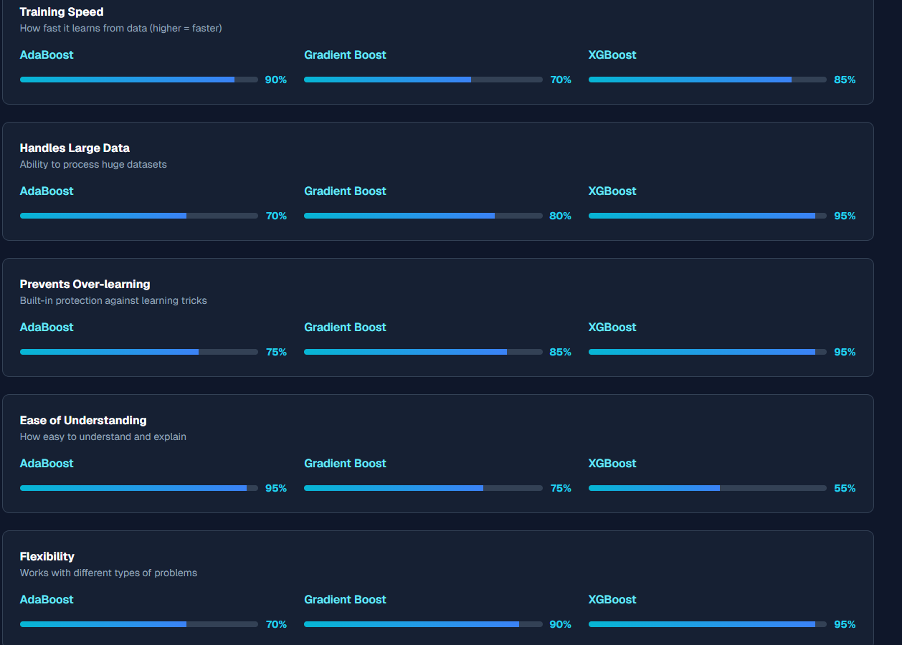
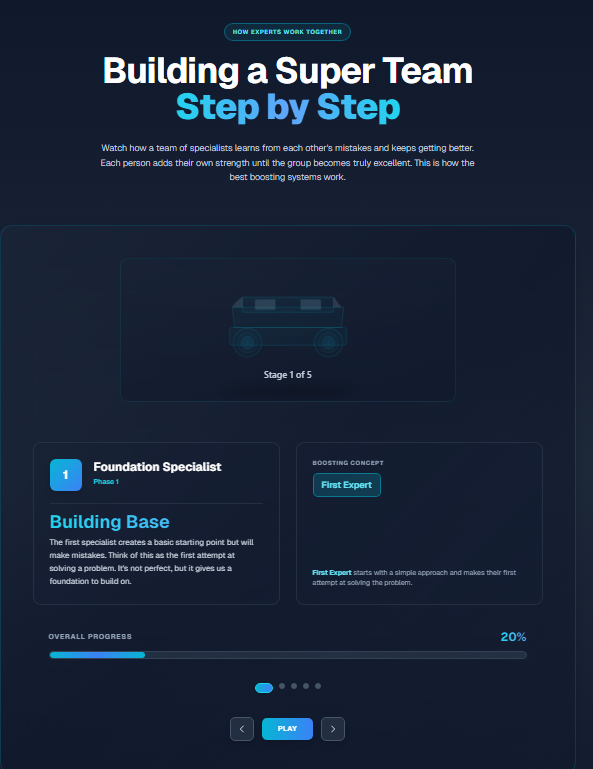
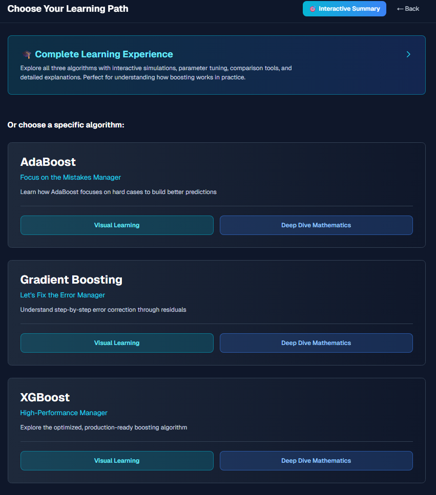
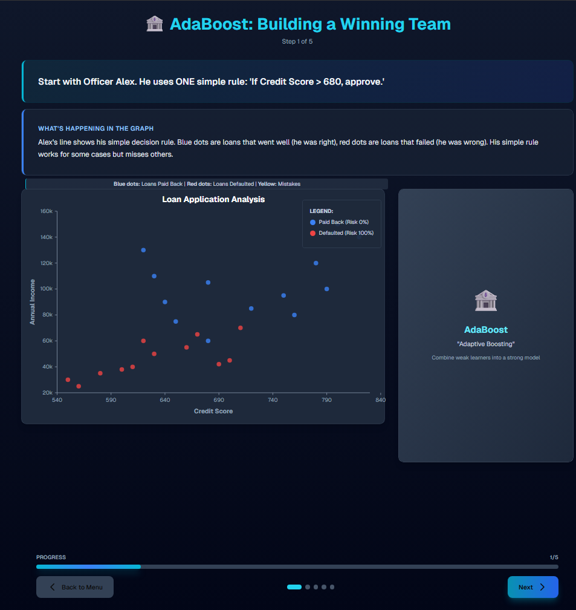

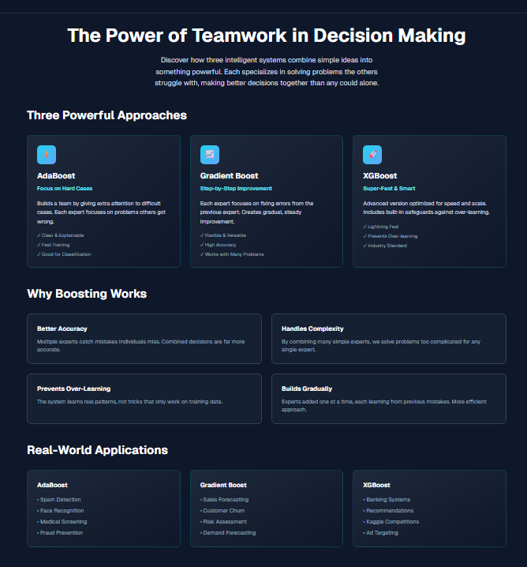


## License

This project is licensed under the terms of the LICENSE file included in the repository.
